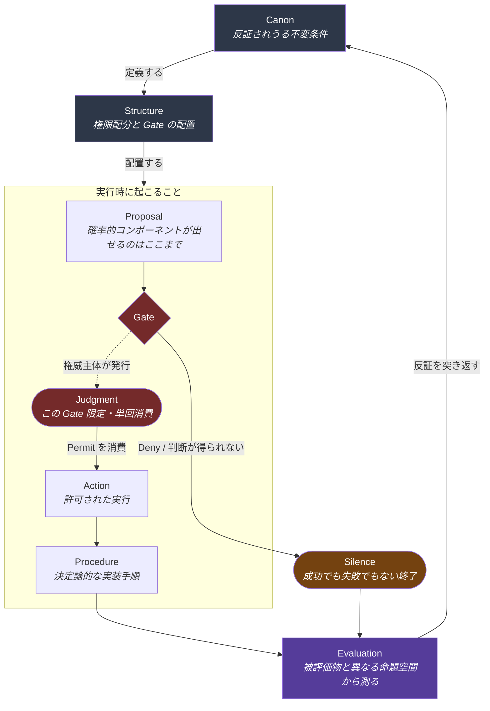

# HEXIS

**Canon / Structure / Judgment / Action / Procedure / Evaluation**

判断を構造的に外在化し、**「正しい判断」と「たまたま当たった判断」を区別可能にする**ための、6要素の参照アーキテクチャ。

- Status: **Draft v0.1**
- 対象: 自律エージェント、高リスク意思決定システム、業務プロセス設計、組織ガバナンス

> [!IMPORTANT]
> **本仕様は適合を証明しない。反証のみできる。**
> HEXIS に「準拠している」と宣言することはできるが、宣言は何も証明しない。
> 本仕様が提供するのは、**準拠していないことを示すための検査手続き**である。
> → [docs/06-conformance.md](docs/06-conformance.md)

## 名前について

`HEXIS`（ヘクシス）は二重の由来を持つ。

- **hex-** — 6要素であること
- **ἕξις (hexis)** — アリストテレスの用語で「そこから適切に判断し行為する、身についた状態」。徳（ἀρετή）はヘクシスであるとされる。行為そのものでも規則そのものでもなく、**行為を生み出す構え**を指す

このフレームワークが記述するのも、判断そのものではなく**判断が生まれる構造**である。

なお、リポジトリ名および正式名称は 6 語をそのまま並べた
`Canon / Structure / Judgment / Action / Procedure / Evaluation` とする。
`HEXIS` は口頭で参照するための短縮名である。

## 中核命題

> **行為を提案するコンポーネントが、その行為の許可可否をも決定するシステムにおいては、
> 「正しい判断」と「たまたま当たった判断」を区別する監査証跡は原理的に構成できない。**

理由は単純である。監査証跡が記録できるのは「何が起きたか」であり、
提案と許可が同一主体に宿るとき、記録に残る許可の根拠は**提案者自身の申告**でしかない。
申告が真であることを、記録の内側から確かめる手段がない。

HEXIS の6要素は、この命題の**系（corollary）**として導入される。
6要素が先にあるのではなく、命題を満たすために必要な最小の分割として6要素が出てくる。

## 全体像

**Judgment は箱ではなく Gate で起こる出来事である。** Gate は Structure が配置し、実行時に複数現れる。
Judgment を単一の層として描かないのが HEXIS の中心的な設計判断である
（理由 → [docs/03-judgment.md](docs/03-judgment.md)）。

図中の Gate が1つに見えるのは簡略化である。実際には egress を含む各境界に置かれ、
**ある Gate で得た Judgment を別の Gate で使うことはできない**（[I3](docs/04-invariants.md#i3)）。

## 6要素

| 要素           | 一言で                              | 誰が書くか                                           | 固有の失敗         |
| -------------- | ----------------------------------- | ---------------------------------------------------- | ------------------ |
| **Canon**      | 破れたら停止する条件                | 人間（改正手続き経由のみ）                           | 規範自体の矛盾     |
| **Structure**  | 権限を誰に配り、Gate をどこに置くか | 人間（確率的主体は不可）                             | 権限の誤配分       |
| **Judgment**   | この文脈で今、許可するか            | 権威主体（人間 / 決定論的規則エンジン / 外部検証器） | 鮮度切れ・文脈漏洩 |
| **Action**     | 許可を消費して起こす実行            | システム                                             | 実行と意図の乖離   |
| **Procedure**  | Action を再現するための手順         | システム（決定論的）                                 | 再現不能           |
| **Evaluation** | 誤りを検出できたか                  | Action 実行主体とは別の主体                          | 検出失敗           |

各要素の厳密な定義 → [docs/02-elements.md](docs/02-elements.md)

## 設計原則

| #      | 原則                              | 一言で                                                                  |
| ------ | --------------------------------- | ----------------------------------------------------------------------- |
| **P0** | 提案する主体は許可しない          | 中核命題そのもの。[I0](docs/04-invariants.md#i0) として形式化される     |
| **P1** | Canon は反証可能な形で書く        | 「安全を最優先する」は Canon ではない。「X が起きたら停止する」が Canon |
| **P2** | Structure は確率的に生成しない    | 権限配分の誤りは以後すべての判断に伝播する                              |
| **P3** | Judgment は状態ではなくイベント   | 発行時刻・文脈・根拠・有効期限を持つ                                    |
| **P4** | Judgment は単回消費               | 一度 Action に消費された許可は再利用できない                            |
| **P5** | Procedure は決定論的              | 同じ入力から同じ手順が再現しないなら Procedure ではない                 |
| **P6** | Evaluation は別の命題空間に属する | 自分の出力を自分で評価する構成は評価ではない                            |
| **P7** | Silence は正当な終了状態          | 「何も返さない」を失敗として扱う設計が judgment leakage を生む          |

## この文書が扱わないこと

- **どう判断すべきか** — HEXIS は判断の内容を規定しない。判断が**どこで・誰によって・どの根拠で**行われたかを追跡可能にするだけである
- **性能・コスト** — Gate を増やせば遅くなる。そのトレードオフは Structure の設計判断であり、本仕様は最適点を示さない
- **法的助言** — [docs/01-motivation.md](docs/01-motivation.md) で EU AI Act に言及するが、規制適合の判断ではない

## ドキュメント

| ファイル                                          | 内容                                             |
| ------------------------------------------------- | ------------------------------------------------ |
| [01-motivation.md](docs/01-motivation.md)         | 問題設定、既存フレームワークとの差分             |
| [02-elements.md](docs/02-elements.md)             | 6要素の定義（責務・禁止事項・入出力）            |
| [03-judgment.md](docs/03-judgment.md)             | Judgment を横断的関心事として再定義する          |
| [04-invariants.md](docs/04-invariants.md)         | 不変条件 **I0〜I9** と要素間インターフェース契約 |
| [05-failure-modes.md](docs/05-failure-modes.md)   | 失敗モード表 —「なぜ6なのか」の反証可能な回答    |
| [06-conformance.md](docs/06-conformance.md)       | 適合レベル L0〜L3 とチェックリスト               |
| [07-worked-example.md](docs/07-worked-example.md) | 適用例                                           |
| [glossary.md](docs/glossary.md)                   | 用語集（日英対応）                               |
| [adr/](docs/adr/README.md)                        | 主要設計決定（ADR-001〜003）                     |

## 由来

本仕様は [Situational-Awareness-and-Decision-Making Discussion #27](https://github.com/shuji-bonji/Situational-Awareness-and-Decision-Making/discussions/27) の
議論を起点とする。Discussion 時点で未決着だった 3 つの論点は、本仕様で以下のように決着させた。

| 論点                                 | 決着                                                                        | 根拠                                                                                         |
| ------------------------------------ | --------------------------------------------------------------------------- | -------------------------------------------------------------------------------------------- |
| Procedure は実行前ゲートか実装手順か | **実装手順**に統一。実行前ゲートは Structure が配置する **Gate** として分離 | [ADR-003](docs/adr/003-procedure-is-deterministic-steps.md) / [02](docs/02-elements.md#procedure) |
| Judgment は単一層か                  | **横断的関心事**。すべての Gate に現れる再評価点                            | [ADR-001](docs/adr/001-judgment-is-event-not-layer.md) / [03](docs/03-judgment.md)          |
| Canon は不変か                       | **変更不可ではない。変更に Canon 自身が定める手続きを要する**               | [04-invariants.md](docs/04-invariants.md#i5)                                                 |

## ライセンス

未定（Draft）
