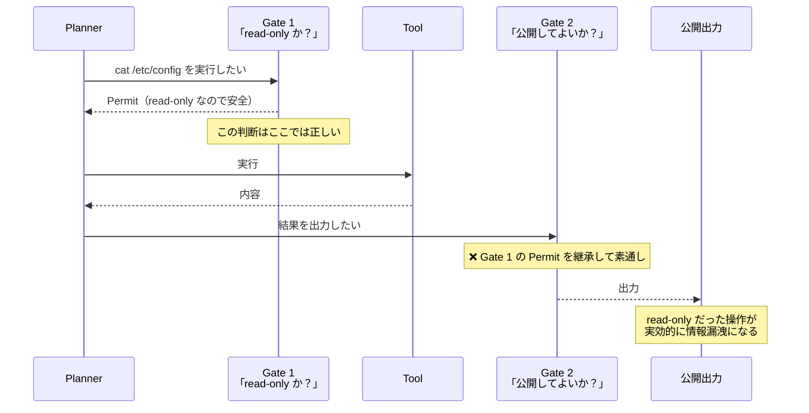

# 01. 問題設定

## 1.1 混在問題

現代の自律エージェントでは、次の3つが同一のコンポーネントに宿りやすい。

| 機能 | 内容 |
|---|---|
| **生成** | 何をすべきかを提案する |
| **判断** | その提案を実行してよいかを決める |
| **実行** | 実際に実行する |

LLM ベースのエージェントでは、この3つが1回の推論の中で融合する。
「ファイルを削除すべきです」と「削除してよい」と「削除しました」が、同じ確率分布から出てくる。

これ自体は動作する。問題は**動作しなくなったときに、何が起きたのかを説明できない**ことである。

## 1.2 「たまたま当たった」問題

これが HEXIS の出発点である。

あるエージェントが1000回の危険な操作要求を受け、999回正しく拒否したとする。
このエージェントは信頼できるか。

**判断できない。** なぜなら、以下の2つを区別する情報が記録に残っていないからである。

| ケース | 記録に残るもの | 実態 |
|---|---|---|
| A | 「拒否した」 | 規範に照らして拒否した |
| B | 「拒否した」 | たまたま拒否側にサンプリングされた |

提案者が許可可否も決めるとき、記録される「拒否の理由」は提案者自身の申告である。
そして LLM の申告する理由は、実際の決定プロセスとは独立に生成されうる
（もっともらしい理由づけは、決定の後から作れる）。

**正当化（justification）と真理条件（truth-maker）が接続されていない。**
これは認識論におけるゲティア問題の、アーキテクチャ上の顕現である。

> 「セマンティック・ロンダリング」— 命題が、正当化と真理条件の接続を持たないまま
> 知識としての地位を得る。LLM-as-judge において特に顕著であり、
> 評価者の判断が被評価物と同じ命題空間に存在するため、循環的な認識論的検証が生じる。
> — [Semantic Laundering in AI Agent Architectures](https://arxiv.org/html/2601.08333)

したがって中核命題は次のように述べられる。

> **行為を提案するコンポーネントが、その行為の許可可否をも決定するシステムにおいては、
> 「正しい判断」と「たまたま当たった判断」を区別する監査証跡は原理的に構成できない。**

「原理的に」と言えるのは、これが実装の巧拙の問題ではなく**情報の問題**だからである。
記録の内側に、申告の真偽を確かめる情報が存在しない。
より賢いモデルを使っても、より詳細なログを取っても解決しない。
**許可を出す主体を、提案を出す主体から分離する以外に方法がない。**

## 1.3 判断の漏洩（judgment leakage）

分離しただけでは足りない。分離した判断が**古びる**からである。

> 現行のエージェント・ハーネスは安全性の判断を早期に行い（このコマンドは read-only、
> このドメインは事前承認済み）、下流のコンポーネントは、その判断が自分の文脈でまだ
> 成立するかを確認せずに継承してしまう。read-only なコマンドも、公開出力チャネルに
> 流れれば実効上 read-only ではない。攻撃者が制御するコンテンツを配信する事前承認済み
> ドメインは、実際には安全ではない。
> — [The Lethal Trifecta: Why AI Agents Require Architectural Boundaries](https://www.cyera.com/blog/the-lethal-trifecta-why-ai-agents-require-architectural-boundaries)

重要なのは、これが**判断の誤りではない**ことである。
早期の判断は、その時点の文脈では正しかった。誤ったのは**継承**のほうである。

したがって Judgment は**単一の層に固定できない**。
「Judgment 層」という箱を1つ描いた瞬間に、この失敗モードが記述できなくなる。

→ [03-judgment.md](03-judgment.md) で、Judgment を横断的関心事として定義しなおす。

## 1.4 沈黙を失敗とみなす設計の弊害

現在のエージェント設計の多くは、次の暗黙の前提を持つ。

> 応答を返さないことは失敗である。

この前提が judgment leakage を積極的に生産する。
なぜなら、判断が得られない状況で「何も返さない」ことが許されないなら、
システムは**判断を得られたことにする**しかないからである。

- 権限が確認できない → 「たぶん大丈夫」で通す
- 情報が不足している → 補完して答える（hallucination の構造的原因の一つ）
- エスカレーション先が応答しない → タイムアウトして続行

HEXIS は `Silence`（沈黙）を、成功でも失敗でもない**第3の正当な終了状態**として定義する。
これは単なる寛容ではなく、**fail-closed を実装可能にするための必要条件**である。
沈黙が失敗として記録されるシステムでは、fail-closed は運用上ペナルティを受け、やがて外される。

## 1.5 既存フレームワークとの差分

| フレームワーク | 扱う範囲 | HEXIS から見た限界 |
|---|---|---|
| **OODA Loop** | Observe → Orient → Decide → Act | 単一主体の認知サイクル。**権限の分離を扱わない**。Decide の主体は Act の主体と同一である前提 |
| **PDCA** | Plan → Do → Check → Act | 改善サイクル。**実行時の許可**という概念がない |
| **See-Judge-Act** | 観察 → 原則に照らした評価 → 行動 | 原則（Canon）と判断の関係を扱う点で近い。ただし**手続き・監査・再現性**の観点がない |
| **ISO/IEC/IEEE 15288** | システムライフサイクルプロセス | プロセス定義は詳細だが、**確率的コンポーネントを前提としていない** |
| **COBIT / TOGAF** | ガバナンスとアーキテクチャ | Canon → Structure の対応は良好。**実行時の判断粒度**まで降りない |
| **ITIL** | 運用手続き | Procedure → Evaluation。**上位規範との接続がない** |
| **EU AI Act Art.14** | 高リスクAIの人間監督 | 法的要件として最も近い（後述）。ただし**設計指針ではない** |

共通する限界は一点に集約される。

> **いずれも、「判断を下す権限が誰にあるか」を実行時に検証可能な形で表現しない。**

OODA の Decide は、決定が行われることを記述するが、
**その決定を行う権限があったか**を問わない。HEXIS はここを埋める。

## 1.6 規制上の位置づけ

EU AI Act Article 14 は高リスク AI に人間監督を要求する。
本仕様にとって重要なのは一般規定より、Annex III 1(a)（生体認証）に対する追加要件である。

> 当該識別が、必要な能力・訓練・権限を有する**少なくとも2名の自然人**によって
> 別個に検証・確認されない限り、システムによる識別に基づいて、
> 導入者はいかなる行為も行わず、いかなる決定も行ってはならない。
> — [EU AI Act Article 14(5)](https://artificialintelligenceact.eu/article/14/)（要旨）

この条文は、HEXIS の主張と構造的に一致する。

| 条文の要素 | HEXIS の対応 |
|---|---|
| 「少なくとも2名の自然人」 | Judgment を発行できる権威主体の明示 |
| 「必要な能力・訓練・**権限**を有する」 | Structure による権限配分 |
| 「**別個に**検証・確認」 | 単一 Gate ではなく独立した複数 Gate |
| 「確認されない限り、いかなる行為も行ってはならない」 | fail-closed（[I1](04-invariants.md#i1)） |

一方で、緊張もある。Article 14(3) は監督措置を
「リスク、自律性の水準、利用文脈に**見合ったもの**」と規定しており、これは**段階的**である。
対して HEXIS の Gate は**離散的**である。
判断は `Permit` か `Deny` の二値で、判断が得られなければ `Silence` に落ちる。
「70% 許可」という中間値は存在しない。

この緊張は Structure の設計で解消する。
**段階性は Gate の粒度と密度で表現し、個々の Gate は離散に保つ。**
低リスク経路は Gate を疎に、高リスク経路は密に配置する。
Gate 自体を「たぶん許可」にすることは認めない（[02 の Judgment の禁止事項](02-elements.md#judgment)）。

## 1.7 3つの設計上の帰結

以上から、HEXIS が満たすべき条件が導かれる。

1. **提案と許可の主体を分離する** → [I0](04-invariants.md#i0)。型の分離（Proposal / Judgment）だけでは足りず、**主体**の分離を不変条件として要求する
2. **許可を境界ごとに再検証する** → [I2](04-invariants.md#i2) / [I3](04-invariants.md#i3)。Judgment に発行 Gate・文脈ハッシュ・有効期限を持たせる
3. **評価を別の命題空間に置く** → [I6](04-invariants.md#i6)。Evaluation の実行主体を Action の実行主体から分離し、外部に接地する

6要素は、この3条件を満たす**最小の分割**として次章で導入される。
6という数の正当化は [05-failure-modes.md](05-failure-modes.md) で行う。

---

## 参照

- [Semantic Laundering in AI Agent Architectures: Why Tool Boundaries Do Not Confer Epistemic Warrant](https://arxiv.org/html/2601.08333)
- [The Lethal Trifecta: Why AI Agents Require Architectural Boundaries](https://www.cyera.com/blog/the-lethal-trifecta-why-ai-agents-require-architectural-boundaries)
- [EU AI Act Article 14: Human Oversight](https://artificialintelligenceact.eu/article/14/)
- [An AI agent can pass every safety check and still leak secrets](https://www.helpnetsecurity.com/2026/07/29/ai-agent-security-safety-check/)
