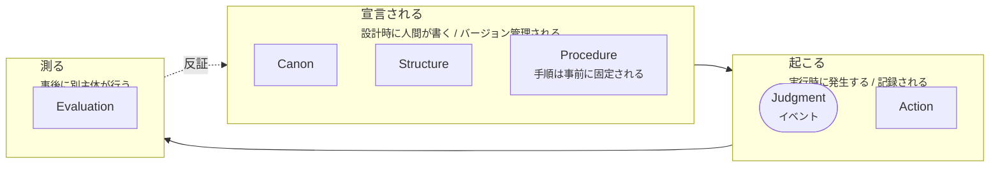

# 02. 6要素の定義

各要素は次の6項目で定義する。

- **定義** — 何であるか
- **責務** — 何を担うか
- **禁止** — 何をしてはならないか（これが最も重要）
- **入力 / 出力** — 要素間の境界
- **固有の失敗** — この要素でしか検出できない誤り
- **反例** — 「これは○○ではない」

---

## 三分類

6要素は同じ性質のものが6つ並んでいるのではない。3つの異なる様態に属する。

この区別を保つことが実装上重要である。
**宣言されるものはバージョン管理され、起こるものは記録され、測るものは独立に実行される。**
3つを同じ機構で扱おうとすると、必ずどこかで循環が生じる。

Procedure が「宣言される」側にあるのは、
手順そのものは実行に先立って固定された成果物だからである。
実行時に発生するのはその `Trace` であり、Procedure 本体ではない。

Judgment だけが角丸で描かれているのは、それが**構造上の場所ではなくイベント**だからである。
理由は [03-judgment.md](03-judgment.md) を参照。
本章で Judgment を他の5要素と並べて節立てするのは、
6要素の一つとして定義を与えるためであり、層として位置づけるためではない。

---

## Canon（規範）

### 定義

**破れたことを検出できる形で書かれた、システムの不変条件の集合。**

### 責務

- システムが「何を正しいとするか」を、下位のすべての要素に先立って固定する
- 自身の改正手続き（Amendment Procedure）を自身の内部に含む

### 禁止

- ❌ **反証不能な言明を Canon に書いてはならない**
- ❌ Canon 自身が定める改正手続き以外の経路で変更してはならない
- ❌ 実行時に参照されない Canon を置いてはならない（飾りの規範は Canon ではない）

### P1 の判定法

ある言明が Canon たりうるかは、次の一文が書けるかで判定する。

> 「**___ が観測されたとき、この Canon は破れている。**」

| 言明 | Canon か | 理由 |
|---|---|---|
| 「常に安全性を最優先する」 | ❌ | 破れたことを観測できない。「最優先した」は事後にいくらでも申告できる |
| 「顧客の個人情報は絶対に外部に出さない」 | △ | 「外部」「個人情報」が未定義。定義を伴えば Canon になる |
| 「`PII` タグの付いたフィールドが `egress` 境界を通過したら、この Canon は破れている」 | ✅ | 観測点と観測対象が特定されている |
| 「本サーバは反証のみ行い、適合を証明しない」 | ✅ | 「conforms to」という語を出力に含めた時点で破れる |

### 入力 / 出力

| | |
|---|---|
| 入力 | 人間の意図、法令、組織の方針、Evaluation からの反証 |
| 出力 | `Invariant[]` — 各 Invariant は観測点・観測対象・違反条件を持つ |

### 固有の失敗

**Canon Contradiction（規範の自己矛盾）**

2つの Invariant が同時に満たせない状態。

下位のどの要素からも検出できない。なぜなら下位の要素はすべて Canon を**前提**として動作し、
Canon の内部矛盾は下位から見ると「片方の Invariant を満たした正常動作」に見えるからである。

検出できるのは Evaluation のみ。しかも Evaluation が参照するのも Canon なので、
**Canon の矛盾検出には外部の視点（人間のレビュー、または別の Canon）が要る。**
これが HEXIS が閉じたループにならない理由である。

### 反例

- ミッションステートメント → 反証可能でないなら Canon ではない
- コーディング規約 → Structure に属する（後述）
- SOLID / DRY / KISS → 設計原理であり、実行時に観測されないため Canon ではない

---

## Structure（構造）

### 定義

**Canon を実行可能な形に具体化したもの。権限の配分と、Gate の配置を定める。**

### 責務

- 誰が / どのコンポーネントが、どの Judgment を発行する権限を持つかを定める（Authority）
- どの境界で Judgment を要求するかを定める（Gate の配置）
- 状態表現、オントロジー、データの所在を定める

### 禁止

- ❌ **確率的コンポーネントが Structure を生成・改変してはならない**（P2）
- ❌ 実行時に Structure を書き換えてはならない（動的な権限昇格の禁止）
- ❌ Canon に根拠を持たない Gate を置いてはならない（すべての Gate はどの Invariant を守るのかを宣言する）

> [!WARNING]
> **なぜ Structure に LLM を入れてはならないのか**
>
> 「LLM は判断してはならないが、構造の補助はしてよい」という設計をよく見るが、これは誤りである。
> Structure は**権限を配る層**である。判断の誤りは1件で済むが、
> 権限配分の誤りは**以後のすべての判断に伝播する**。
> 判断層に確率的モデルを置くより、構造層に置くほうが危険度が高い。

### 入力 / 出力

| | |
|---|---|
| 入力 | `Invariant[]`（Canon から） |
| 出力 | `Authority[]`, `Gate[]`, `Ontology` |

### 固有の失敗

**Authority Misallocation（権限の誤配分）**

Judgment を発行する権限が、それを持つべきでない主体に与えられている状態。

Judgment 自身からは検出できない。**各 Judgment は自分に権限があるかを疑わない**からである。
権限の妥当性は、Judgment より上位の視点でしか評価できない。

### 反例

- 組織図 → Authority を含むなら Structure の一部
- クラス設計 → Gate を含まないなら Structure ではなく単なる実装
- 「Planner → Reasoner → Executor」という構成図 → **Gate が描かれていないなら Structure ではない**

---

## Judgment（判断）

### 定義

**特定の Gate において、特定の権威主体が、特定の文脈に対して発行する、
有効期限付き・単回消費の許可または拒否。**

Judgment は**層ではなくイベント**である。詳細は [03-judgment.md](03-judgment.md) を参照。
イベントであるため「責務」は Judgment 自身ではなく、
それを発行する**権威主体**と、発行の場である **Gate** が負う。

### 権威主体が負う責務

- Proposal と現在の文脈に対し、`Permit` または `Deny` を発行する
- 判断の根拠となった Invariant を `basis` に明示する
- 判断が有効な文脈の範囲（`contextHash`, `scope`, `expiresAt`）を確定する

Gate 側の責務（Proposal の受理、文脈の計算、既存 Judgment の検証、Silence への遷移）は
[3.3](03-judgment.md#33-gate) に定義する。**Gate は Judgment を発行しない。**

### 禁止

- ❌ **提案を出した主体が、その提案の Judgment を発行してはならない**（[I0](04-invariants.md#i0)）
- ❌ **確率的コンポーネントは Judgment を発行できない。Proposal のみ発行できる**（[I7](04-invariants.md#i7)）
- ❌ Judgment を発行された Gate 以外に持ち越してはならない（[I3](04-invariants.md#i3)）
- ❌ 有効期限のない Judgment を発行してはならない
- ❌ 「たぶん許可」を返してはならない。確信が持てないなら `Silence`（これは Judgment ではない）

### 入力 / 出力

| | |
|---|---|
| 入力 | `Proposal`, `Context`, `Authority` |
| 出力 | `Judgment`（`decision` は `Permit` / `Deny` の二値）、または `Silence`（Terminal） |

全フィールドの定義は [04-invariants.md](04-invariants.md#インターフェース契約型スケッチ) にある。

### 固有の失敗

**Judgment Staleness / Leakage（鮮度切れ・文脈漏洩）**

発行時には正しかった判断が、消費される時点では文脈が変わっており妥当でなくなっている状態。

Action からは検出できない。**Action から見れば有効な Judgment が添付されている**からである。
検出には、判断の発行時文脈と消費時文脈を比較する機構が要る（[I2](04-invariants.md#i2)）。

### 反例

- if 文 → 権威主体を持たないなら Judgment ではなく Procedure の一部
- LLM の「これは安全だと思われます」 → **Proposal である。Judgment ではない**
- 事前承認されたドメインのリスト → Structure（許可の**方針**）であり、個別の Judgment ではない

---

## Action（行動）

### 定義

**有効な Judgment を消費して行われる、外界の状態を変える操作。**

### 責務

- Judgment を消費する（消費は不可逆。[I4](04-invariants.md#i4)）
- 実行の結果を記録する
- 実行が意図と乖離した場合にそれを報告する

### 禁止

- ❌ **Judgment を伴わない Action を実行してはならない**（fail-closed / [I1](04-invariants.md#i1)）
- ❌ 消費済みの Judgment を再利用してはならない
- ❌ Action が自ら Judgment を生成してはならない

### 入力 / 出力

| | |
|---|---|
| 入力 | `Judgment`（Permit かつ未消費）, `Context` |
| 出力 | `Terminal`。実装は `Procedure` に委譲する |

### 固有の失敗

**Execution Divergence（実行と意図の乖離）**

許可されたものと実際に起きたことが異なる状態。
API が別の副作用を持っていた、部分的に失敗した、冪等でなかった、など。

Judgment からは検出できない。**Judgment は結果を見ていない**（判断は実行に先立つ）。
検出には、許可の内容と Outcome を突き合わせる機構が要る。

### 反例

- 内部状態の計算 → 外界を変えないなら Action ではない
- ログ出力 → 外部から観測可能なら Action である（情報の egress は状態変化）
- **何もしないこと** → `Silence` は Action ではなく、Action が起きなかったことの記録

---

## Procedure（手順）

### 定義

**Action を再現可能に実装するための、決定論的な手順の列。**

> [!NOTE]
> **Discussion #27 で未決着だった論点の決着**
>
> Discussion では Procedure に2つの用法が混在していた。
>
> 1. 実行前ゲート（検証 → 承認 → エスカレーション）
> 2. Action の実装手順（PDFを開く → Hash生成 → 署名 → タイムスタンプ）
>
> 本仕様は **2 に統一する**。1 は **Gate** として Structure に属させる。
>
> 理由: 1 は「権限」の話であり、2 は「再現性」の話である。
> 両者は失敗モードが異なる（権限の誤配分 vs 再現不能）ため、
> 同じ名前で呼ぶと [05-failure-modes.md](05-failure-modes.md) の分割基準に反する。

### 責務

- Action を、誰が / どのシステムが実行しても同じ結果になる手順に分解する
- 各ステップの前提条件と事後条件を明示する
- 失敗時のロールバック手順を**記述**する

> ロールバックは外界の状態を変えるため、それ自体が Action である。
> したがって Procedure が持てるのは**手順の記述**までであり、
> ロールバックの実行には別の Judgment が要る（[I1](04-invariants.md#i1)）。
> 自動ロールバックを許すなら、Structure に「ロールバック Gate」を置き、
> その Authority を決定論的規則エンジンにすること。

### 禁止

- ❌ **Procedure の内部で Judgment を発行してはならない**（判断が要るなら、そこは Gate であり Structure の管轄）
- ❌ 非決定論的な分岐を含んではならない（P5）
- ❌ Procedure が Canon を参照してはならない（参照が要るなら、それは Gate）

> 判定法: **「この手順の途中で人間に確認を取る必要があるか？」**
> Yes なら、そこは Procedure ではなく Gate である。Procedure を2つに割り、間に Gate を置く。

### 入力 / 出力

| | |
|---|---|
| 入力 | `Action`, 決定論的な環境 |
| 出力 | `Step[]`, `Trace` |

### 固有の失敗

**Non-reproducibility（再現不能）**

同じ入力から同じ手順が再現しない状態。

**単発の実行では原理的に検出できない。** 検出には複数回の実行の比較が要る。
これが Procedure を独立した要素として立てる理由である
（他のどの要素も、単発実行の観測から再現性を判定できない）。

### 反例

- ReAct ループ → LLM の分岐を含むなら決定論的でないため Procedure ではない
- 承認フロー → Gate の連なりであり Procedure ではない
- リトライ処理 → 条件が決定論的でも、リトライの**実行**には新しい Judgment が要る（[I4](04-invariants.md#i4)）。Procedure に書けるのは手順だけで、許可は「リトライ Gate」から得る

---

## Evaluation（評価）

### 定義

**Action の実行主体とは異なる主体が、被評価物とは異なる命題空間から、
Canon が破れていないかを事後に測る活動。**

### 責務

- Canon の各 Invariant について、破れの有無を測る
- 破れが検出された場合、原因がどの要素にあるかを切り分ける
- 検出できなかった破れがあった場合、それ自体を記録する（自己の失敗の記録）

### 禁止

- ❌ **Action の実行主体が自らを Evaluation してはならない**（[I6](04-invariants.md#i6)）
- ❌ **被評価物と同じ命題空間で評価してはならない**（P6）
- ❌ Evaluation の結果が Canon の改正手続きを経ずに Canon を書き換えてはならない

> [!WARNING]
> **LLM-as-judge は原則として Evaluation ではない**
>
> 評価者の出力が被評価物と同じ命題空間（自然言語のもっともらしさ）にあるとき、
> 「良い評価」と「もっともらしい評価文」を区別する情報が記録に残らない。
> これは 1.2 で述べた中核命題の、Evaluation 側での再現である。
>
> LLM を Evaluation に使うこと自体は禁じないが、**別の命題空間への接地**が要る。
> 例: 実行結果の外形的な事実（HTTP ステータス、ファイルの存在、検証器の判定）と
> 突き合わせる。突き合わせ先がないなら、それは Evaluation ではなく Proposal である。

### 入力 / 出力

| | |
|---|---|
| 入力 | `Invariant[]`, `Trace[]`, `Outcome[]`, `Judgment[]`（消費済みを含む）, **`ExternalGrounding`** |
| 出力 | `Finding[]` — 反証されたもののみ。「問題なし」は「反証できなかった」を意味する |

`ExternalGrounding` は省略できない（[I6](04-invariants.md#i6)）。
他の入力はすべて被評価系自身の出力であるため、
これがなければ評価は同じ命題空間に閉じてしまう。

### 固有の失敗

**Detection Failure（検出失敗）**

破れが起きたのに検出できなかった状態。

**定義上、他のどの要素も Evaluation を評価しない。**
これは HEXIS の構造的な限界であり、隠すべきではない。
Evaluation の失敗を検出できるのは、外部の視点だけである。

だからこそ Evaluation の出力は「適合」ではなく「**反証できなかった**」でなければならない。
→ [06-conformance.md](06-conformance.md)

### 反例

- 単体テスト → Canon の Invariant に紐づいていないなら Evaluation ではなく Procedure の検証
- 満足度アンケート → Canon に「満足度が X を下回ったら破れ」とあるなら Evaluation
- モニタリングダッシュボード → 誰も見ないなら Evaluation ではない（測定は行為であって、表示ではない）

---

## 要素間の関係の要約

| From | To | 渡されるもの | 禁じられる逆流 |
|---|---|---|---|
| Canon | Structure | `Invariant[]` | Structure が Canon を書き換える |
| Structure | Gate | `Authority`, `Gate` 配置 | 実行時の権限昇格 |
| Proposal | Judgment | 提案内容 | 提案主体が自らを Permit する（[I0](04-invariants.md#i0)） |
| Judgment | Action | 単回消費の許可 | Action が Judgment を生成する |
| Action | Procedure | 実装依頼 | Procedure が Judgment を発行する |
| Procedure | Evaluation | `Trace` | Evaluation が実行に介入する |
| Evaluation | Canon | `Finding[]`（反証） | 改正手続きを経ない書き換え |

「禁じられる逆流」列のうち最初の1行は不変条件として形式化されている（[I0](04-invariants.md#i0)）。
残りは各要素の禁止事項として上に記した。

形式的な契約定義 → [04-invariants.md](04-invariants.md)
