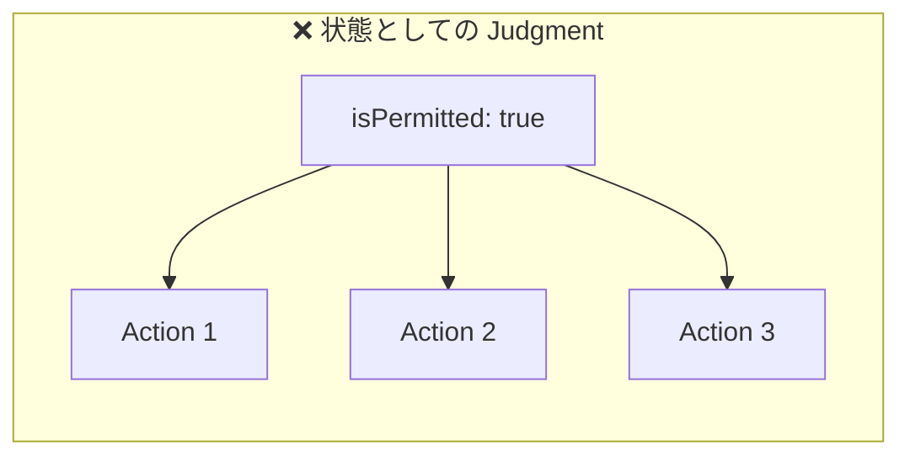
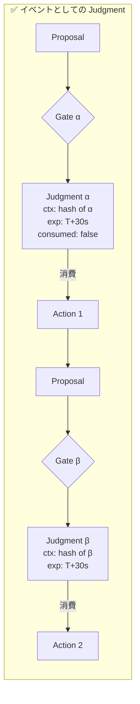
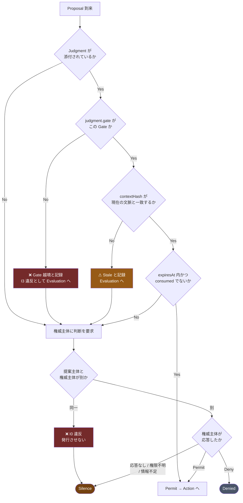
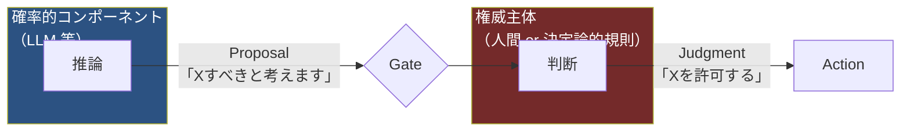
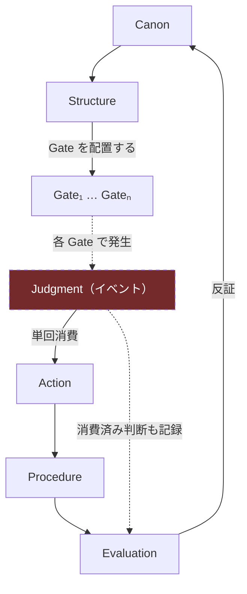

# 03. Judgment を横断的関心事として再定義する

これが HEXIS の中心的な設計判断である。

> **Judgment は層ではない。すべての境界に現れる再評価点である。**

## 3.1 なぜ単一層にできないのか

「Judgment 層」という箱を1つ描くと、次の3つが記述できなくなる。

### (a) 判断は古びる

Gate 1 で「read-only だから安全」と判断した。その判断は Gate 1 の文脈では正しい。
しかし Gate 2（公開出力）の文脈では、同じ操作の同じ結果が情報漏洩になる。

判断を1箇所に固定するモデルでは、**この2つを別の判断として扱えない**。

### (b) 判断には文脈がある

「このファイルを削除してよい」は、命題として完結していない。
正しくは「**この文脈において**、このファイルを削除してよい」である。

文脈が変われば同じ命題の真理値が変わる。
Judgment を状態（`isPermitted: true`）として持つと、文脈が落ちる。

### (c) 判断は消費される

「1回削除してよい」という許可を、2回の削除に使ってはならない。
状態として持つ限り、この単回性は表現できない。

## 3.2 Judgment の定義

以上から、Judgment は次の性質を持つ**イベント**として定義される。





### 構成要素

型定義の正は [04-invariants.md](04-invariants.md#インターフェース契約型スケッチ) にある。ここでは意味を述べる。

| フィールド    | 意味                                  | 欠けたときに起きること                                                           |
| ------------- | ------------------------------------- | -------------------------------------------------------------------------------- |
| `decision`    | `Permit` / `Deny` の**二値**          | —                                                                                |
| `proposal`    | どの Proposal に対する判断か          | [I0](04-invariants.md#i0) の検査ができない                                       |
| `authority`   | 誰が発行したか（AuthorityRef）        | 権限のない主体の判断が混入する                                                   |
| `gate`        | どの Gate で発行されたか              | **他の Gate に持ち越せてしまう → judgment leakage**（[I3](04-invariants.md#i3)） |
| `contextHash` | 発行時の文脈のハッシュ                | 同じ Gate での文脈変化を見落とす（[I2](04-invariants.md#i2)）                    |
| `issuedAt`    | 発行時刻                              | 有効期限が計算できない                                                           |
| `expiresAt`   | 有効期限                              | 無期限に古い判断が使われる                                                       |
| `basis`       | 根拠となった `InvariantRef[]`（非空） | Canon との接続が切れ、Evaluation が原因を切り分けられない                        |
| `scope`       | 許可される操作の範囲                  | 過剰な権限が渡る                                                                 |
| `consumed`    | 消費済みフラグ                        | 再利用（replay）が可能になる                                                     |

> [!IMPORTANT]
> **`Silence` は `decision` の値ではない。**
>
> Silence は「判断が**発行されなかった**」ことである。
> Judgment の一種として表現すると、`authority` が不在のときに
> 「誰が発行したのか」が答えられなくなる。
> したがって Silence は `Terminal` 側の状態としてのみ存在する（[3.5](#35-silence)）。

`gate`、`contextHash`、`consumed` の3つが、既存のフレームワークにない部分である。
`gate` が Gate 間の持ち越しを、`contextHash` が同一 Gate での文脈変化を、
`consumed` が replay を封じる。

## 3.3 Gate

**Gate は、Structure が配置する、Judgment が発生する地点である。**

Gate は Judgment を**発行しない**。Gate は次を行う。

1. 到来した Proposal を受け取る
2. 現在の文脈を計算する
3. 添付された既存の Judgment があれば、それが**この Gate で発行されたもの**かを検証する（[I3](04-invariants.md#i3)）
4. この Gate のものであれば、`contextHash` が現在の文脈と一致するかを検証する（[I2](04-invariants.md#i2)）
5. いずれかを満たさない、または Judgment がない場合、権威主体に判断を要求する
6. 判断が得られない場合、`Silence` で終了する

3 と 4 は別の検査である。3 が Gate 間の持ち越しを、4 が同一 Gate での文脈変化を弾く。

> **添付された Judgment が使われるのは、同じ Gate に再到達したときだけである。**
> 典型例は、事前に発行された Judgment を持って Gate に来る場合
> （人間が先に承認しておく運用）と、同一 Gate を含むループの2周目である。
> 上流の別 Gate で得た Judgment がここで使われることは、[I3](04-invariants.md#i3) により決してない。



### Gate の配置は Structure の設計判断

Gate を密に置けば安全性が上がり、遅くなる。疎に置けばその逆。
本仕様は最適点を示さない。示すのは配置の**制約**のみである。

> **すべての egress 境界には Gate を置かなければならない（MUST）。**
>
> egress 境界とは、情報がシステムの信頼境界の外に出る地点をいう。
> 出力、外部 API 呼び出し、ログ、通知、ファイル書き出しを含む。
>
> 理由: [1.3](01-motivation.md#13-判断の漏洩judgment-leakage) で見たとおり、
> judgment leakage は egress で顕現する。上流で何を判断していようと、
> egress での再評価がなければ leakage は防げない。
>
> **唯一の例外**は、Structure の `outOfScope` に理由つきで宣言された範囲である
> （[6.5](06-conformance.md#65-部分適用)）。宣言なき省略は Gate Omission である。

## 3.4 Proposal と Judgment の分離



### 型として分離する

`Proposal` と `Judgment` を同じ型にしてはならない。
同じ型なら、いつか代入される。

```typescript
// [04-invariants.md] の型定義からの抜粋。正はそちら

type Proposal = {
  readonly _tag: 'Proposal';
  id: ProposalId;
  proposer: SubjectRef; // I0: authority と一致してはならない
  intent: string;
  suggestedScope: Scope;
  reasoning?: string; // 参考情報。根拠（basis）ではない
};

type Judgment = {
  readonly _tag: 'Judgment';
  decision: 'Permit' | 'Deny'; // Silence は含まない
  authority: AuthorityRef; // Proposal には存在しないフィールド
  gate: GateRef; // I3
  contextHash: Hash; // I2
  consumed: boolean; // I4
  basis: NonEmptyArray<InvariantRef>; // I9
  // …（issuedAt, expiresAt, scope, id, proposal は 04 章参照）
};

// Action は Permit かつ未消費の Judgment しか受け取れない
declare function execute(
  j: Judgment & { decision: 'Permit'; consumed: false },
  ctx: Context,
): Terminal;
```

**`Proposal` から `Judgment` への変換関数は、権威主体しか呼べない。**
かつ、**その権威主体は当の Proposal の生成主体であってはならない**
（[I0](04-invariants.md#i0) / [I7](04-invariants.md#i7)）。
実装言語が型で強制できるなら型で、できないなら実行時チェックと監査で担保する。

### LLM の `reasoning` を根拠にしてはならない

Proposal に含まれる `reasoning` は**参考情報**であって、`basis` ではない。

- `basis` は Canon の Invariant への参照であり、権威主体が選ぶ
- `reasoning` は自然言語であり、事後に生成可能である

[1.2](01-motivation.md#12-たまたま当たった問題) で述べたとおり、
もっともらしい理由づけは決定の後から作れる。
LLM の reasoning を `basis` に昇格させると、中核命題の前提に戻ってしまう。

## 3.5 Silence

`Silence` は、成功でも失敗でもない第3の終了状態である。

### いつ Silence になるか

| 状況                                    | なぜ Silence か                                      |
| --------------------------------------- | ---------------------------------------------------- |
| 権威主体が応答しない                    | 判断が存在しない。「たぶん許可」で代替してはならない |
| 権威主体が特定できない                  | Structure に穴がある。実行してはならない             |
| 判断に必要な情報が不足している          | 補完すると hallucination になる                      |
| Canon の Invariant が相互に矛盾している | どちらを守るかを機械が決めてはならない               |

### Silence の記録

Silence は「何もしなかった」ではない。**「判断が得られなかったので実行しなかった」という事実**である。
したがって記録される。

```typescript
type Terminal =
  | { state: 'Completed'; outcome: Outcome; judgment: JudgmentId }
  | {
      state: 'Denied';
      basis: NonEmptyArray<InvariantRef>;
      judgment: JudgmentId;
    }
  | { state: 'Silence'; cause: SilenceCause; gate: GateRef } // ← 失敗ではない
  | { state: 'Failed'; error: ExecutionError }; // ← これが失敗

type SilenceCause =
  | 'AuthorityUnavailable' // 権威主体が応答しない
  | 'AuthorityUndefined' // Structure に権威主体の定義がない
  | 'InsufficientContext' // 判断に必要な情報が足りない
  | 'CanonContradiction'; // Invariant が相互に矛盾している
```

`Silence` は `judgment` フィールドを持たない。**判断が存在しないから Silence なのである。**
`AuthorityUnavailable` / `AuthorityUndefined` のとき「誰が Silence を発行したのか」を
問わずに済むのは、Silence を Judgment の一種にしなかったためである。

### なぜこれが必要なのか

**Silence を失敗として集計するシステムでは、fail-closed は生き残れない。**

fail-closed な Gate は SLA を悪化させる。悪化した指標は改善対象になる。
改善の最も簡単な方法は Gate を緩めることである。
こうして安全機構は、運用の圧力によって静かに外される。

`Silence` を独立した終了状態として持つことは、
**「判断が得られなかった回数」を「システムの失敗」とは別の指標として運用に載せる**ための仕掛けである。

Silence 率が高いことは、システムの故障ではなく **Structure の設計不足**を示す。
改善すべきは Gate ではなく、権威主体の可用性か、Canon の網羅性である。

## 3.6 Judgment が横断的であることの帰結

Judgment を単一層として描かない結果、[README](../README.md) の全体像は次のように読まれる。



Judgment だけが点線で描かれるのは、**それが構造上の場所ではなく出来事だから**である。

この扱いには代償がある。

| 得たもの                      | 失ったもの                                |
| ----------------------------- | ----------------------------------------- |
| judgment leakage を記述できる | 図が単純な6層スタックにならない           |
| 文脈依存性を型で表現できる    | 「Judgment 層の担当者」を組織図に書けない |
| replay を封じられる           | Gate ごとの権威主体を全て定義する負担     |

3つ目の負担は実務上重い。Gate を1つ置くたびに「誰が判断するのか」を決めねばならない。
しかしそれは HEXIS が作り出した負担ではなく、**元からあった曖昧さを可視化しただけ**である。

次: [04-invariants.md](04-invariants.md) — これらを不変条件として形式化する
