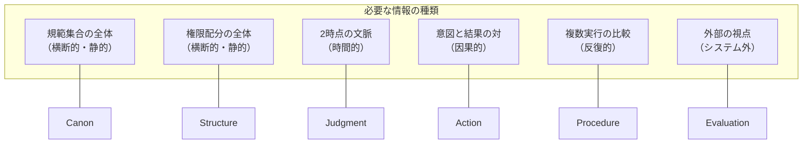
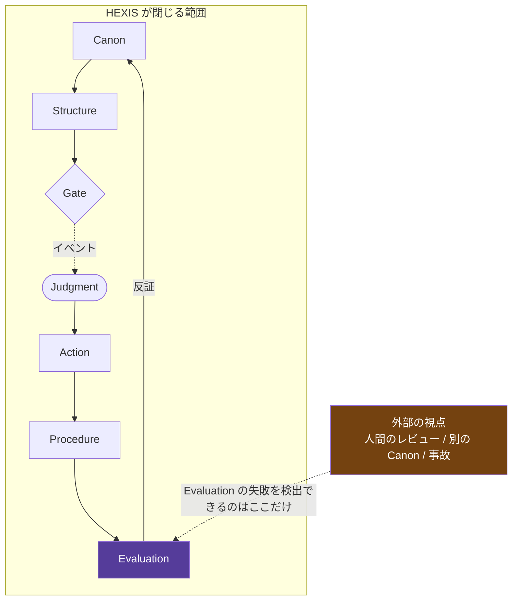

# 05. なぜ6つなのか — 失敗モードによる正当化

「6層モデル」を名乗るフレームワークは無数にある。
それらの大半が忘れられるのは、**なぜ6なのかを答えないから**である。

本章は、その問いに反証可能な形で答える。

---

## 5.1 分割基準

要素を分ける唯一の正当な理由は、**固有の失敗モードを持つこと**である。

> **分割基準**
>
> 要素 X と要素 Y を分けてよいのは、
> **X でしか検出できない失敗が存在し、かつ Y でしか検出できない失敗が存在する**ときに限る。
>
> どちらか一方でも欠けるなら、X と Y は畳まなければならない。

「概念的に違う」「抽象度が違う」は分割の理由にならない。
抽象度で分けると層はいくらでも増やせるが、増やしても検出できる誤りは増えない。

なお基準は「固有の失敗を**少なくとも1つ**持つこと」であって、
「ちょうど1つ持つこと」ではない。1つの要素が複数の固有失敗を持つことは許される
（Structure がその例である。後述）。

---

## 5.2 失敗モード表

| 要素 | 固有の失敗 | 検出に必要な情報 | 他要素で検出できない理由 |
|---|---|---|---|
| **Canon** | **Canon Contradiction** 2つの Invariant が同時に満たせない | Invariant 集合の全体 | 下位要素はすべて Canon を前提とするため、矛盾は「片方を満たした正常動作」に見える |
| **Structure** | **Authority Misallocation** 権限が誤った主体に配られている | 権限配分の全体像 | 個々の Judgment は**自分に権限があるかを疑わない** |
| **Structure** | **Gate Omission** 置くべき境界に Gate がない | Gate 配置 × 実際の実行経路 | Gate がなければ Judgment イベントが1件も生成されず、実行時の記録には**何も現れない** |
| **Judgment** | **Staleness / Leakage** 発行時と消費時で文脈が変わっている、または別 Gate に持ち越された | 発行時文脈と消費時文脈の**両方**、および `gate` | Action からは有効な Judgment が添付されて見える |
| **Action** | **Execution Divergence** 許可された内容と実際の結果が異なる | 許可内容と実行結果の対 | Judgment は実行に先立つため**結果を見ていない** |
| **Procedure** | **Non-reproducibility** 同じ入力で手順が再現しない | **複数回の実行の比較** | 単発の実行の観測からは原理的に判定できない |
| **Evaluation** | **Detection Failure** 破れを検出できなかった | 検出できなかった破れの存在 | **定義上、他のどの要素も Evaluation を評価しない** |

### 表の読み方

3列目「検出に必要な情報」が、分割の実質的な根拠である。
7つの失敗はそれぞれ**異なる情報を必要とする**。

Structure だけが2つ持つ。Authority Misallocation は「権限配分の全体像」から、
Gate Omission は「Gate 配置 × 実行経路」から検出され、必要な情報が異なるためである。
どちらも Structure の管轄なので、要素を増やす理由にはならない
（[5.4](#54-7つ目を足すべきか) の Gate の項を参照）。

同じ情報を必要とする失敗が2つあれば、その2要素は畳める。
表を見るかぎり、6つはすべて異なる情報を要求している。

---

## 5.3 畳めるか検証する

分割基準を自分自身に適用する。畳める組み合わせがあれば、6という数は誤りである。

### Canon と Structure を畳めるか

**畳めない。**

| | Canon Contradiction | Authority Misallocation |
|---|---|---|
| Canon だけがある世界 | 検出可能 | 権限という概念がないため**発生しない**が、代わりに「誰でも判断できる」状態になり I7 が破れる |
| Structure だけがある世界 | 規範がないため矛盾も定義できない | 検出可能 |

両方が必要。ただし**境界は運用上ぼやけやすい**。
「PII を外部に出さない」（Canon）と「PII を扱えるのは role=X のみ」（Structure）は近い。

判定法: **その言明を破ったかどうかを、実行時に観測できるか。**
観測できるなら Canon。観測される前に配置を決めるものなら Structure。

### Action と Procedure を畳めるか

これが最も疑わしい組み合わせである。

**畳めない。理由は Procedure の失敗が単発実行から検出できないこと。**

| 観測 | Action の失敗か | Procedure の失敗か |
|---|---|---|
| 1回実行して、結果が意図と違った | ✅ Execution Divergence | 判定不能 |
| 10回実行して、結果がばらついた | 各回は正常かもしれない | ✅ Non-reproducibility |

Action は**1回の実行の中**で評価される。Procedure は**実行の集合**に対して評価される。
評価の対象となる単位が違う以上、同じ要素にはできない。

> **これが Discussion #27 で Procedure の位置が揺れた本当の理由**だと考えられる。
> 「実行前ゲート」としての Procedure は、実は Action と同じ単位（1回の実行）で評価される。
> だから Action と混ざる。
> 一方「実装手順」としての Procedure は集合に対して評価されるので、Action と混ざらない。
>
> 分割基準に照らすと、**「実装手順」の定義のほうが正当である**。
> [02-elements.md](02-elements.md#procedure) の決着は、この分析に基づく。

### Judgment と Action を畳めるか

**畳めない。** これは HEXIS の中核命題そのものである（[01](01-motivation.md#12-たまたま当たった問題)）。
畳んだ瞬間に、提案者が許可者になり、監査証跡が構成できなくなる。

### Evaluation と Canon を畳めるか

**畳めない。しかし完全には分離できない。**

Evaluation は Canon を参照して測る。Canon は Evaluation の Finding によって改正される。
相互参照がある。

にもかかわらず分ける理由は、**Detection Failure が Canon Contradiction と別物**だから。

- Canon が正しくても、Evaluation が下手なら破れを見逃す
- Evaluation が完璧でも、Canon が矛盾していれば何を測るべきか定まらない

ただし、この相互参照が **HEXIS が閉じたループにならない理由**でもある（5.5 参照）。

---

## 5.4 7つ目を足すべきか

分割基準は、足すことにも適用される。
**新しい要素を足してよいのは、既存6要素のどれでも検出できない失敗を持つときだけ。**

候補を検討する。

| 候補 | 固有の失敗を持つか | 判定 |
|---|---|---|
| **Perception（知覚）** | 入力の誤り。ただし「文脈の誤り」は Judgment の Staleness に含まれる | ❌ Judgment に畳む |
| **Intent（意図）** | 意図と Canon の乖離。しかしこれは Canon Contradiction の一種 | ❌ Canon に畳む |
| **Memory（記憶）** | **記憶の汚染**。過去の情報が現在の判断を誤らせる。検出には記憶の来歴が要る | ⚠️ **保留** |
| **Communication（伝達）** | 主体間の伝達での意味の変質 | ⚠️ **保留** |
| **Gate** | **Gate Omission** という固有の失敗を持つ。ただし配置を決めるのは Structure であり、検出も Structure のレビューで行う | ❌ Structure の2つ目の失敗として扱い、要素は増やさない |

Memory と Communication は、判断を下せていない。

- **Memory**: 記憶の汚染は、`contextHash` に記憶の来歴を含めれば Judgment の Staleness として捉えられる。しかし「汚染された記憶が正しく見える」ケースは、Judgment からは検出できないかもしれない
- **Communication**: マルチエージェント系では、内部チャネル経由の情報漏洩が独立した失敗モードを持つという報告がある（[AgentLeak](https://researchgate.net/publication/400742326_AgentLeak_A_Full-Stack_Benchmark_for_Privacy_Leakage_in_Multi-Agent_LLM_Systems)）

**本仕様 v0.1 は、この2つを未解決の課題として明示的に残す。**
6が正しい数だと主張しているのではなく、
**6要素の分割は分割基準を満たしており、7つ目を足す根拠はまだ示されていない**、が本仕様の立場である。

これは反証可能な主張である。
Memory または Communication に固有の失敗モードが示されれば、本仕様は改訂される（[I5](04-invariants.md#i5)）。

---

## 5.5 このモデルは閉じていない

失敗モード表の最終行を読み直す。

> **Evaluation** — Detection Failure — **定義上、他のどの要素も Evaluation を評価しない**

したがって次が成り立つ。

> **HEXIS は自己の Evaluation の失敗を検出できない。**

これを隠すべきではない。むしろ本仕様の最も重要な主張の一つである。

### 帰結

1. **HEXIS に準拠したシステムは安全ではない。** 反証されなかっただけである
2. **外部レビューを設計に組み込まねばならない。** これはフレームワークの外側にある
3. **事故は情報である。** 事故が起きたとき、それは Evaluation の Detection Failure の証拠であり、Canon 改正の入力になる

自己完結を主張するフレームワークは、この最終行を持たない。
そして最終行を持たないフレームワークは、Evaluation が壊れたときに壊れたことに気づけない。

---

## 5.6 失敗モードから逆引きする診断表

運用中に問題が起きたとき、どの要素を疑うか。

| 症状 | 疑うべき要素 | 確認すること |
|---|---|---|
| 許可されるはずのないことが実行された | Judgment → Structure | Gate が配置されているか。権威主体は正しいか |
| 同じ操作が2回実行された | Judgment（I4） | `consumed` フラグの実装 |
| 内部で安全だったものが外部に漏れた | Judgment（I2/I3） | egress Gate の有無、`contextHash` の対象 |
| 判断の理由がログから追えない | Judgment（I9） | `basis` が空になっていないか |
| 同じ手順が環境によって結果が違う | Procedure | 非決定論的分岐の混入 |
| 全部うまくいっているように見える | **Evaluation** | Silence 率が 0 でないか（[I8](04-invariants.md#i8)） |
| 何を守るべきか誰も答えられない | Canon | Invariant が反証可能な形か（P1） |
| Gate が形骸化している | Structure → Canon | Gate が指す Invariant がまだ有効か |

最後から2番目の行を再掲する。

> **全部うまくいっているように見える → Evaluation を疑う**

Silence 率 0、Finding 0、Stale 0 のシステムは、
完璧なのではなく**測っていない**可能性のほうが高い。

---

次: [06-conformance.md](06-conformance.md) — 適合レベルとチェックリスト
