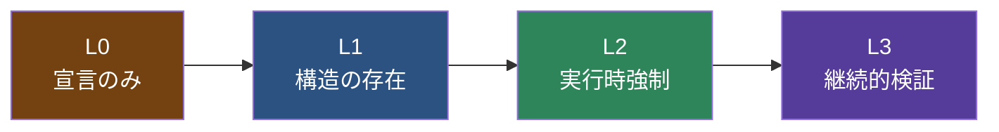
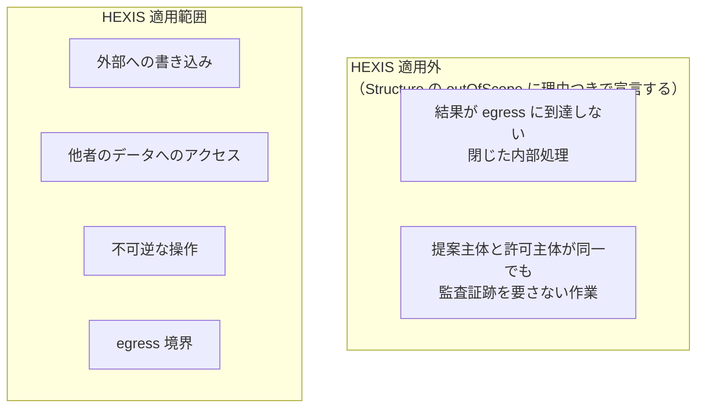

# 06. 適合レベルとチェックリスト

## 6.1 三つを区別する

本仕様は次の3語を厳密に使い分ける。混同すると、この文書全体が意味をなさなくなる。

| 語 | 意味 | 誰が言うか | 証明力 |
|---|---|---|---|
| **宣言** declaration | 「本システムは HEXIS に従う」という自己申告 | システムの作り手 | **なし** |
| **適合** conformance | 実際に不変条件を満たしている状態 | 誰も言えない | **証明不能** |
| **検証** validation | 特定の検査手続きで反証されなかった事実 | 検査を実行した主体 | **検査が覆う範囲内でのみ有効** |

> [!IMPORTANT]
> **適合は証明できない。反証できるだけである。**
>
> 「HEXIS に適合している」と書いてはならない。書いてよいのは
> 「**検査 X を実行し、反証されなかった**」である。
>
> 不変条件を満たしていないシステムに適合を宣言させると、
> **何も宣言しないシステムより悪い**。読み手が検査を省く根拠を与えるからである。

この立場は恣意的なものではない。
[05.5](05-failure-modes.md#55-このモデルは閉じていない) で示したとおり、
HEXIS は自己の Evaluation の失敗を検出できない。
自己の検出能力の限界を知らないシステムが、適合を主張することはできない。

---

## 6.2 適合レベル

宣言できるのは「レベル」であって「適合」ではない。
各レベルは**何が検査されたか**を表す。

### L0 — 宣言のみ

6要素の語彙を用いて設計が記述されている。

**証明力: なし。** L0 は「HEXIS の語彙で会話できる」以上のことを意味しない。
L0 を「適合」と呼んではならない。

### L1 — 構造の存在

以下がドキュメントとして存在し、レビュー可能である。

- 反証可能な形で書かれた Canon（`violationCondition` を持つ Invariant）
- Authority と Gate の配置を含む Structure
- 各 Gate が守る Invariant の対応表

**検査方法:** ドキュメントレビュー。コードは見ない。
**証明力: 設計意図が記述されていること。実装との一致は未検査。**

### L2 — 実行時強制

L1 に加え、以下が実行時に強制されている。

- [I0](04-invariants.md#i0) Proposer/Authority Separation — 提案主体が自らの提案を許可できない
- [I1](04-invariants.md#i1) Fail-Closed — Judgment なしに Action が実行されない
- [I2](04-invariants.md#i2) Freshness — `contextHash` が検証されている
- [I3](04-invariants.md#i3) Gate Binding — `judgment.gate` が消費 Gate と一致することが検証されている
- [I4](04-invariants.md#i4) Single Consumption — 消費済み Judgment が再利用されない
- [I7](04-invariants.md#i7) Authority Non-Delegation — 確率的コンポーネントが Judgment を出せない
- [I9](04-invariants.md#i9) Basis Traceability — `basis` が空でない

**検査方法:** 反証テストの実行（後述のチェックリスト）。
**証明力: 実行した反証テストが覆う範囲でのみ。**

I0 が L2 の先頭にあるのは、これが[中核命題](01-motivation.md#12-たまたま当たった問題)の形式化であり、
これを欠く限り他の不変条件をいくら満たしても監査証跡が成立しないためである。

### L3 — 継続的検証

L2 に加え、以下が継続的に測られている。

- [I3](04-invariants.md#i3) の暗黙的な破れ — Gate スキップの静的解析が CI に組み込まれている
- [I5](04-invariants.md#i5) Canon Amendment — 承認記録のない Canon 変更が CI で落ちる
- [I6](04-invariants.md#i6) Evaluation Independence — 評価が外部接地を持ち、それが被評価 Judgment の入力でない
- [I8](04-invariants.md#i8) Silence Validity — Silence 率が独立指標として記録されている
- Stale 率、Gate 越境率、Finding 数が時系列で追跡されている
- Silence 率が 0 の場合、それが構造的に正常であることが Structure に記載されている

**検査方法:** CI 設定と監視設定の検査 + 指標の時系列。
**証明力: 検出能力そのものが監視されている。ただし Detection Failure は依然として外部からしか見えない。**

---

## 6.3 反証チェックリスト

各項目は「これが起きたら不変条件は破れている」という形式で書かれている。
**チェックが付かないことは適合を意味しない。反証できなかったことを意味する。**

### Canon

- [ ] **C-1** Invariant に `violationCondition` を持たないものがある → P1 違反
- [ ] **C-2** Canon に `amendmentProcedure` が存在しない → [I5](04-invariants.md#i5) 違反
- [ ] **C-3** `observedAt` が空の Invariant がある（どの Gate からも参照されず、Evaluation でも測られていない） → 飾りの規範
- [ ] **C-4** 2つの Invariant が同時に満たせないケースを構成できる → Canon Contradiction
- [ ] **C-5** バージョン履歴に、承認記録のない遷移がある → [I5](04-invariants.md#i5) 違反

### Structure

- [ ] **S-1** `guards` が空の Gate がある → Canon に根拠のない Gate
- [ ] **S-2** 適用範囲内の egress 境界に Gate が置かれていない経路がある → Gate Omission（[3.3](03-judgment.md#33-gate) 違反）
- [ ] **S-3** `kind` が確率的コンポーネントである Authority がある → [I7](04-invariants.md#i7) 違反
- [ ] **S-4** 実行時に `authorities` を書き換えるコードパスがある → 動的権限昇格
- [ ] **S-5** `excludedFromContext` に `rationale` のない項目がある → [I2](04-invariants.md#i2) 違反
- [ ] **S-6** Structure が LLM の出力から生成されている → P2 違反
- [ ] **S-7** `kind: 'DeterministicRule'` の Authority に `proposerControlledInputs` の記載がない → [I0](04-invariants.md#i0) の抜け道が未列挙
- [ ] **S-8** `outOfScope` が記載されていない → 実質 L0（[6.5](#65-部分適用)）

### Judgment

- [ ] **J-1** `Outcome` があるのに対応する Permit がないトレースがある → [I1](04-invariants.md#i1) 違反
- [ ] **J-2** **同一 Gate** への再生テストで、分類ラベルを変えても `Stale` が記録されない → [I2](04-invariants.md#i2) 違反
- [ ] **J-3** 前段の Gate 通過を理由に Gate をスキップする分岐がある → [I3](04-invariants.md#i3) 違反（暗黙）
- [ ] **J-4** 同一 `Judgment.id` が2つ以上の `Outcome` に紐づいている → [I4](04-invariants.md#i4) 違反
- [ ] **J-5** `authority` の値が LLM 出力から直接構成されている → [I7](04-invariants.md#i7) 違反
- [ ] **J-6** `basis` が空の Judgment がある → [I9](04-invariants.md#i9) 違反（Silence は Judgment ではないため対象外）
- [ ] **J-7** `expiresAt` を持たない Judgment がある → [02](02-elements.md#judgment) 違反
- [ ] **J-8** `basis` が現行 Canon に存在しない `InvariantRef` を指しており、かつ Amendment Procedure が遡及無効化を定めている → [I5](04-invariants.md#i5) の遡及処理漏れ
- [ ] **J-9** `judgment.gate !== 消費された Gate` のトレースがある → [I3](04-invariants.md#i3) 違反（明示）
- [ ] **J-10** `Judgment.authority` が、対応する `Proposal.proposer` と一致するものがある → [I0](04-invariants.md#i0) 違反
- [ ] **J-11** 規則エンジンの入力のうち、提案主体が支配できるものが Structure に未列挙 → [I0](04-invariants.md#i0) の抜け道

### Action

- [ ] **A-1** Judgment を生成するコードが Action 側にある → [02](02-elements.md#action) 違反
- [ ] **A-2** リトライ時に新しい Judgment を取得していない → [I4](04-invariants.md#i4) / [I2](04-invariants.md#i2) 違反
- [ ] **A-3** 許可された `scope` を超える操作が実行されたトレースがある → Execution Divergence
- [ ] **A-4** ロールバックが Judgment なしに実行されている → [I1](04-invariants.md#i1) 違反（ロールバックも Action）

### Procedure

- [ ] **P-1** Procedure の内部に Judgment 発行がある → [02](02-elements.md#procedure) 違反
- [ ] **P-2** 同一入力で複数回実行し、`Trace` が一致しない → Non-reproducibility
- [ ] **P-3** Procedure が Canon を直接参照している → そこは Gate であるべき
- [ ] **P-4** LLM の分岐を含む手順を Procedure と呼んでいる → P5 違反

### Evaluation

- [ ] **E-1** 評価主体と実行主体が同一である → [I6](04-invariants.md#i6) 違反
- [ ] **E-2** `grounding`（外部接地）を持たない評価がある → [I6](04-invariants.md#i6) 違反
- [ ] **E-6** `grounding` が、評価対象の Judgment の入力と同一である → [I6](04-invariants.md#i6) 違反（循環）
- [ ] **E-3** 評価結果が「適合」という語を含む → 6.1 違反
- [ ] **E-4** Evaluation が Canon を改正手続きなしに書き換える経路がある → [I5](04-invariants.md#i5) 違反
- [ ] **E-5** Evaluation が検出できなかった破れを記録する仕組みがない → Detection Failure が不可視

### 運用

- [ ] **O-1** `Silence` が `Failed` と同じカウンタに入っている → [I8](04-invariants.md#i8) 違反
- [ ] **O-2** Silence 率が **0** で、かつそれが構造的に正常である理由が Structure に記載されていない → **Gate が機能していない疑い**（[05.6](05-failure-modes.md#56-失敗モードから逆引きする診断表)）
- [ ] **O-3** Stale 率・Gate 越境率が測られていない → [I2](04-invariants.md#i2) / [I3](04-invariants.md#i3) の効果が不明
- [ ] **O-4** 外部レビューの仕組みがない → [05.5](05-failure-modes.md#55-このモデルは閉じていない) の帰結2 に反する

---

## 6.4 宣言の書き方

L2 に達したシステムが書いてよい文言の例。

> 本システムは HEXIS Draft v0.1 の **L2** で検査されている。
> 反証チェックリストのうち C-1〜C-5, S-1〜S-8, J-1〜J-11, A-1〜A-4 を実行し、
> いずれも反証されなかった。P-2（再現性）は未実施である。
> 直近30日の Silence 率は 2.3%、Stale 率は 0.4% であった（時系列追跡は未整備）。
>
> **これは本システムが安全であることを意味しない。**
> 上記の検査が覆わない範囲の誤りは検出されていない。

書いてはならない例。

> ❌ 本システムは HEXIS に準拠しています。
> ❌ HEXIS 適合。
> ❌ HEXIS L3 認証済み。

3つ目が特に悪い。**本仕様は認証制度を持たない。**
検査を実行するのは常にシステムの側であり、検査結果は自己申告である。
外部の認証があるかのように書くことは、[6.1](#61-三つを区別する) の宣言と検証の混同にあたる。

---

## 6.5 部分適用

すべてのシステムが L3 を目指す必要はない。
むしろ**どこに適用しないかを明示する**ほうが実用的である。

> [!CAUTION]
> **「読み取り専用だから適用外」としてはならない。**
>
> [1.3](01-motivation.md#13-判断の漏洩judgment-leakage) の中心事例がまさにこれである。
> read-only な操作の結果が egress に到達すれば、実効的に情報漏洩になる。
> 適用外にできるのは「読み取り専用」ではなく「**結果が egress に到達しない**」場合に限る。

適用範囲の宣言は Structure の `outOfScope` に書かれる（MUST）。
各項目には理由（`rationale`）を添える（MUST）。

**適用外の範囲を書かないシステムは、実質的に L0 である。**
どこまで守られているのか読み手が判定できないためである。

適用外と宣言された範囲については、
[3.3](03-judgment.md#33-gate) の「すべての egress 境界に Gate を置く」という MUST は適用されない。
これが当該 MUST の唯一の例外である。

---

次: [07-worked-example.md](07-worked-example.md) — 実例への写像
