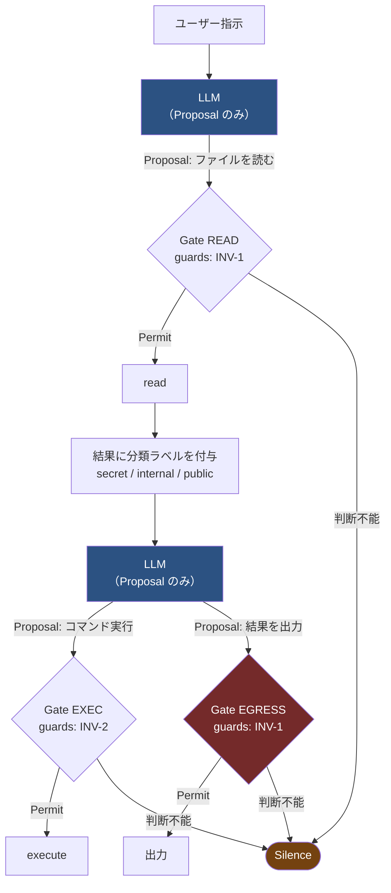
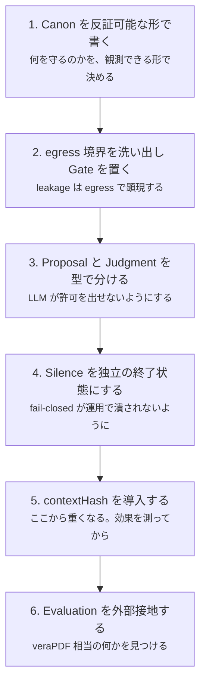

# 07. 適用例

抽象的な仕様は、写像してみるまで正しさが分からない。
本章では既存のシステムに HEXIS を当て、**どこが埋まっていてどこが空いているか**を見る。

「うまく当てはまる例」だけを載せると仕様の弱点が隠れるため、
**当てはまらない部分も記録する。**

## 7.1 例A — PDF 信頼性監査（pdf-trust / pdf-verify-mcp）

受け取った PDF が本物か・改ざんされていないかを監査する MCP サーバ群。
HEXIS 以前に設計されたが、結果的に多くの要素を満たしている。

### 写像

| 要素           | 対応するもの                                                                                                                                                                                                 |
| -------------- | ------------------------------------------------------------------------------------------------------------------------------------------------------------------------------------------------------------ |
| **Canon**      | 「本サーバは反証する。適合や署名の信頼性を証明しない」 「declaration / conformance / validation を区別せよ」 「trust_anchors のない valid は、暗号が通っただけで署名者が本人であることを意味しない」 |
| **Structure**  | サーバの責務分割そのもの。reader は**観測**のみ、spec は**規範テキスト**のみ、verify が**判定**を下す、writer は**宣言を書けるが適合させられない**                                                           |
| **Gate**       | `evaluate_policy` の呼び出し点。判断を下す唯一の地点                                                                                                                                                         |
| **Judgment**   | `evaluate_policy` が返す4値判定。決定論的ルールエンジンが下す                                                                                                                                                |
| **Action**     | 監査結果に基づく受入 / 拒否                                                                                                                                                                                  |
| **Procedure**  | 各 MCP ツールの内部処理（PDF を開く → オブジェクトを走査 → 結果を返す）。決定論的                                                                                                                            |
| **Evaluation** | 受入判断が事後に誤りだったと判明したか（後述のとおり、ここが最も薄い）                                                                                                                                       |

> [!WARNING]
> **pdf-trust Skill の監査手順は Procedure ではない**
>
> 「どのツールをどの順で呼ぶか」は一見 Procedure に見えるが、
> ① その列の中に Gate（`evaluate_policy`）が含まれ、
> ② 手順を駆動するのが LLM（Skill）であって決定論的でない。
> [P-1](06-conformance.md#procedure) と [P-4](06-conformance.md#procedure) の両方に抵触する。
>
> 正しくは、**Skill の手順は Gate の連なりであり、Structure に属する**。
> Procedure はその各ステップの内側にある。
> Discussion #27 で Procedure の位置が揺れたのと同じ混同が、実例でも起きる。

### 特筆すべき点

このシステムは [I7](04-invariants.md#i7)（確率的コンポーネントは Judgment を発行できない）を、
**設計時点で満たしている**。

> 4値判定は pdf-verify-mcp の evaluate_policy（**決定論的ルールエンジン**）が下し、
> Skill は発火ルールの解説・推奨アクション・法令根拠を担う。

LLM（Skill）は解説と推奨を出す。判定は下さない。これは Proposal と Judgment の分離そのものである。

また [6.1](06-conformance.md#61-三つを区別する) の宣言 / 適合 / 検証の区別も、
設計時点で徹底されている。

> T2 — ISO 19005 (PDF/A): この family の corpus に標準がない。**veraPDF が判定する**。
> 「veraPDF がこれを COMPLIANT と判定した」と書け。「ISO 19005 に適合する」とは決して書くな。

判定の言明が、外部検証器という別の命題空間に接地されている。

### 埋まっていない部分

| 要素                                                          | 状態                | 何が足りないか                                                                                                                                                                                                              |
| ------------------------------------------------------------- | ------------------- | --------------------------------------------------------------------------------------------------------------------------------------------------------------------------------------------------------------------------- |
| **Judgment の鮮度**（[I2](04-invariants.md#i2)）              | ❌ 未実装           | 監査結果に `contextHash` も `expiresAt` もない。**失効した証明書で署名された PDF が、監査後に失効したら判定は古びる**。CRL/OCSP の取得時刻が判定の有効期限であるべき                                                        |
| **単回消費**（[I4](04-invariants.md#i4)）                     | ❌ 未実装           | 監査結果を何度でも別の受入判断に流用できる                                                                                                                                                                                  |
| **Silence**（[I8](04-invariants.md#i8)）                      | △ 部分的            | `trust: not_evaluated` や `needs_external_fact` は実質的に Silence だが、**成功・失敗と別の終了状態として集計されていない**                                                                                                 |
| **Canon の Amendment Procedure**（[I5](04-invariants.md#i5)） | ❌ なし             | Canon は MCP サーバの instructions として書かれているが、変更手続きは定義されていない                                                                                                                                       |
| **Evaluation の独立性**（[I6](04-invariants.md#i6)）          | ❌ **循環している** | veraPDF は `evaluate_policy` の**入力**である。同じものを Evaluation の接地先にすると、判定の誤りを独立に検出できない。真の Evaluation は「受入判断が事後に誤りだったと判明した事例」であり、それは**システムの外**から来る |

**HEXIS を当てて分かること**: この系列で最も価値のある改善は
`needs_external_fact` / `not_evaluated` を**独立の終了状態として集計する**ことである。
これらが多いということは、判定が下せていないということであり、
成功として集計されていると検出能力の低下が見えなくなる（[O-2](06-conformance.md#運用)）。

## 7.2 例B — コーディングエージェント

ファイルを読み書きしコマンドを実行するエージェント。
[1.3](01-motivation.md#13-判断の漏洩judgment-leakage) の judgment leakage が最も起きやすい対象。

### Canon（抜粋）

| Ref     | Invariant                            | violationCondition                                     | observedAt                 |
| ------- | ------------------------------------ | ------------------------------------------------------ | -------------------------- |
| `INV-1` | 秘密情報は信頼境界の外に出ない       | `secret` タグの付いた値が egress Gate を通過した       | `Gate READ`, `Gate EGRESS` |
| `INV-2` | 破壊的操作は明示的な許可を要する     | `destructive` 分類の Action が Permit なしに実行された | `Gate EXEC`                |
| `INV-3` | 実行されたコマンドはすべて記録される | `Outcome` に対応する `Trace` がない                    | `Evaluation`               |
| `INV-4` | 判断できない場合は実行しない         | Judgment が得られない状態で Action が実行された        | `Evaluation`               |

`INV-4` は [I1](04-invariants.md#i1) の Canon への写しである。

`INV-3` と `INV-4` の `observedAt` が `Evaluation` なのは、
どちらも**1つの Gate では観測できない**ためである。
「記録がない」ことも「Permit なしに実行された」ことも、
実行後にトレース全体を走査して初めて分かる。
`observedAt` が空でなければ [C-3](06-conformance.md#canon) に抵触しない。

### Structure — Gate の配置

`Gate EGRESS` が赤いのは、ここが [I3](04-invariants.md#i3) の要になるためである。

### leakage を防ぐ動作

[1.3](01-motivation.md#13-判断の漏洩judgment-leakage) のシナリオを再演する。

| ステップ                    | HEXIS なし                     | HEXIS あり                                                                                   |
| --------------------------- | ------------------------------ | -------------------------------------------------------------------------------------------- |
| 1. `cat /etc/config` の提案 | 「read-only だから安全」で許可 | `Gate READ` が Permit。`judgment.gate = READ`、`contextHash = h(gate=READ, class=unknown)`   |
| 2. 実行                     | 実行                           | 実行。結果に `secret` ラベルが付く                                                           |
| 3. 結果を出力したい         | 「もう許可済み」で素通し       | `Gate EGRESS` に到達。添付された Judgment の `gate` は `READ` → **この Gate のものではない** |
| 4.                          | 漏洩                           | Gate 越境として記録し、`Gate EGRESS` の権威主体に判断を要求。得られなければ `Silence`        |

**防いだのは [I3](04-invariants.md#i3)（Judgment は発行された Gate でしか有効でない）**である。

`contextHash` に `class`（分類ラベル）を含めることは、
これとは別の失敗 —— **同じ `Gate EGRESS` を2回通るとき、
1回目は `public` だったものが2回目は `secret` になっている** —— を防ぐ（[I2](04-invariants.md#i2)）。
2つは別の防御であり、両方が要る。

### 実務上のコスト

正直に書く。この設計は重い。

| コスト           | 内容                            | 緩和策                                                                                                              |
| ---------------- | ------------------------------- | ------------------------------------------------------------------------------------------------------------------- |
| 権威主体の負担   | egress のたびに人間の判断が要る | 決定論的規則エンジンを Authority にする。「`public` ラベルのみなら自動 Permit」は規則で書ける。**ただし下記の注意** |
| レイテンシ       | Gate ごとに往復                 | 低リスク経路は Gate を疎に（[1.6](01-motivation.md#16-規制上の位置づけ) の段階性）                                  |
| 分類ラベルの付与 | すべての結果に分類が要る        | 保守的なデフォルト（不明なら `secret`）。ただし Silence 率が上がる                                                  |
| Silence の多発   | 初期は判断不能が頻発する        | **これは仕様どおり**。Silence 率を Structure の改善指標として使う                                                   |

最後の行が重要である。
Silence の多発は失敗ではなく、**Structure に穴があることの可視化**である。
穴を塞ぐ（権威主体を定義する / 規則を書く）ことで減っていく。

> [!CAUTION]
> **分類ラベルを誰が付けるかが [I0](04-invariants.md#i0) の急所**
>
> 「`public` ラベルのみなら自動 Permit」という規則は決定論的だが、
> **ラベルを付けているのが提案側の LLM なら、判定内容は実質的に提案者が決めている。**
> 記録に残る許可の根拠は、再び提案者の申告になる。
>
> ラベル付与は決定論的でなければならない（パターンマッチ、データソースの出自、
> スキーマ上の型など）。LLM に分類させる場合、それは Proposal であり、
> 分類そのものに Gate が要る。
>
> この経路は `Authority.proposerControlledInputs` に列挙する（MUST）。
> 列挙されていれば設計判断として可視だが、
> **列挙されていなければ I0 は静かに破れている**。

## 7.3 例C — 当てはまらない例

HEXIS が向かない対象も記録しておく。仕様の適用範囲を誤ると害になる。

### 探索的なデータ分析

読み取りのみで、外部への書き込みがなく、結果を**人間が必ず目視してから**次に進む。

- egress Gate は「人間の目」として既に存在している。Gate がないのではなく、
  **形式化されていないだけ**である。したがって Gate Omission ではない
- Judgment を形式化する利得より、手数の増加が上回る
- **`outOfScope` に「結果が人間の目視を経ずに egress に到達しない」と理由つきで宣言すべき**
  （[6.5](06-conformance.md#65-部分適用)）
- 目視を経ずに自動で次工程に流れる経路が1つでもあれば、この宣言は成立しない

### 単一の人間が全工程を行う作業

提案者と許可者が同一だが、それが**問題にならない**場合。

中核命題は「区別する監査証跡が構成できない」と述べており、
**監査証跡が要らないなら命題は無害**である。

判定法: **「後から誰かに説明する必要があるか」**。
ないなら HEXIS は過剰である。

### リアルタイム制御

Gate の往復が物理的に間に合わない領域（数ミリ秒以下）。

この場合、判断は**事前**に済ませるしかない。
ただしそれは「設計時の Judgment」ではない。
[02](02-elements.md#judgment) の定義により、事前に固定された許可の**方針**は Structure であって
Judgment ではない（個別の文脈に対する判断ではないため）。

つまり実行時に Judgment イベントが発生しない。
HEXIS の実行時モデル（[I0](04-invariants.md#i0)〜[I4](04-invariants.md#i4)）は適用できず、
Canon・Structure・Evaluation のみが適用できる。

**部分適用を明示すること。**「HEXIS の Canon / Structure / Evaluation のみ適用」と書く。
この場合、[I0](04-invariants.md#i0) は実行時ではなく**設計時に人間が保証する**ことになり、
中核命題への対処は HEXIS の外側（設計レビュー）に移る。それを明記すること。

## 7.4 導入の順序

一度にすべてを入れる必要はない。効果の大きい順に並べる。

1〜4 までで [1.2](01-motivation.md#12-たまたま当たった問題) の中核命題への対処は済む。
5〜6 は [1.3](01-motivation.md#13-判断の漏洩judgment-leakage) の leakage への対処であり、
必要性はシステムの性質による。

**4 を飛ばして 5 に進んではならない。**
Silence が失敗として扱われる環境で `contextHash` を入れると、
Stale の多発が「システムの品質低下」として報告され、真っ先に外される。

次: [glossary.md](glossary.md)
